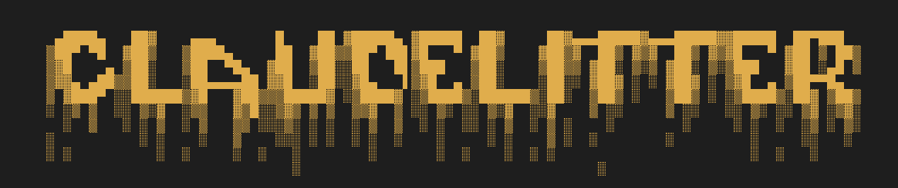
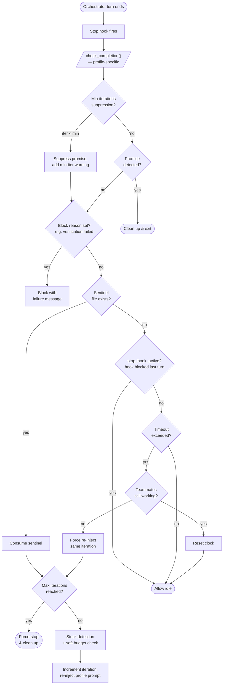

<div align="center">
  
  <br />
  <em>An enhancement suite for Claude Code agent teams</em>
  <br /><br />

<a href="https://www.python.org/downloads/"></a>
<a href="https://github.com/Und3rf10w/claude-litter/releases"></a>
<a href="https://code.claude.com/"></a>
<a href="https://textual.textualize.io/"></a>

</div>

---

**Claude Litter** is an enhancement suite for [Claude Code](https://code.claude.com) agent teams. Its core is the **[swarm-loop plugin](plugins/swarm-loop)** — an orchestrated multi-agent loop that decomposes complex goals into parallel subtasks, drives autonomous iteration with hook-based safety, and exits only when a user-defined completion promise is fulfilled. Alongside the plugin, a **[terminal UI](src/)** gives you a live control plane for managing teams, agents, tasks, and swarm executions without leaving the terminal.

---

## Why Claude Litter?

Claude Code's native agent teams are powerful, but undercooked. The swarm-loop plugin adds structured orchestration on top of teams — iterative loops with safety classifiers, stuck detection, and progress tracking — while the TUI provides a simple interface that can assistant with managing the.

<div align="center">

|                   | Pain                                  | Claude Litter                           |
| ----------------- | ------------------------------------- | --------------------------------------- |
| Orchestration     | Manual agent coordination             | Swarm loop with autonomous iteration    |
| Team overview     | `cat ~/.claude/teams/*/config.json`   | Live sidebar with status indicators     |
| Agent transcripts | Buggy interface                       | Tabbed sessions with full history       |
| Task tracking     | Manual JSON edits                     | Filterable panel with inline editing    |
| Messaging         | Write to inbox JSON files             | Compose form with broadcast support     |
| Agent lifecycle   | Shell commands, manual PID tracking   | Spawn, kill, detach, reattach in-UI     |
| Swarm monitoring  | `cat .claude/swarm-loop/*/state.json` | Live progress, phase, and log streaming |

</div>

---

## Features

### Swarm Loop Plugin

_The core of Claude Litter — orchestrated multi-agent iteration for Claude Code._

- **Iterative orchestration** with profile-driven cycles (default 7-step, leanswarm 4-concern, deepplan 5-phase planning, async background agents)
- **Hook-based safety** — bash classifier, teammate idle gate, task completion/creation gates, sentinel timeout recovery
- **Completion promise** system with optional shell verification (`--verify`)
- **Iteration control** — soft budget checkpoints, hard min/max floors and ceilings, stuck detection with permission-aware escalation
- Configurable via `.claude/swarm-loop.local.md` — classifier model/effort, teammate isolation (shared or worktree), max count, notifications

See [Swarm Loop Plugin](#swarm-loop-plugin-1) for full documentation.

### Terminal UI

_A control plane for managing Claude Code agent teams and swarm executions._

- **Team sidebar** with live status indicators (active / partial / inactive) and colored agent badges
- **Tabbed sessions** with full conversation transcript history loaded from JSONL files
- **Swarm panel** with live iteration status, phase, autonomy health, progress bars, and incremental log streaming
- **Task panel** with filtering (pending / in-progress / completed / blocked), sorting (ID / status / owner), and inline editing
- **Message panel** with inbox view, broadcast view, and compose form
- **Agent lifecycle** — spawn with model selection, configure, duplicate cross-team, kill, detach, reattach
- **Kitty terminal** pop-out: open agents in splits, tabs, or new windows
- **Live filesystem watching** — changes to team/task/inbox/swarm JSON files refresh the UI automatically
- **10 built-in themes**, vim mode, command mode with Tab autocomplete, debug logging

---

## Swarm Loop Plugin

The **swarm-loop** plugin is an orchestrated multi-agent iterative development system for Claude Code. It decomposes complex goals into parallel subtasks, creates a persistent agent team, and drives autonomous iteration until a user-defined completion promise is fulfilled.

### How It Works

At setup, the plugin creates an **instance directory** (`.claude/swarm-loop/<id>/`) containing a `state.json` (structured state), `log.md` (narrative history), and `progress.jsonl` (append-only progress tracking). It installs a set of Claude Code hooks into `.claude/settings.local.json` and loads the selected **profile** — a directory containing the orchestrator prompt template, completion logic, and re-injection script.

The loop is driven by the **stop hook** (`stop-hook.sh`), which fires every time the orchestrator's turn ends. The orchestrator itself never loops; the hook creates the iteration cycle:



<details>
<summary>Text diagram</summary>

```
           ┌────────────────────────────┐
           │   Orchestrator turn ends   │
           └─────────────┬──────────────┘
                         │
           ┌─────────────▼──────────────┐
           │      Stop Hook Fires       │
           └─────────────┬──────────────┘
                         │
           ┌─────────────▼──────────────┐
           │  check_completion()        │
           │  (profile-specific)        │
           └─────────────┬──────────────┘
                         │
           ┌─────────────▼──────────────┐
       ┌───┤  Min-iterations reached?   │
       │   └─────────────┬──────────────┘
  iter < min              │ yes
       │   ┌─────────────▼──────────────┐
       │   │     Promise detected?      │
       │   └──────┬─────────────┬───────┘
       │        yes             no
       │          │              │
       │   ┌──────▼──────┐       │
       │   │ Clean up &  │       │
       │   │    exit     │       │
       │   └─────────────┘       │
       │                         │
       └────────────┐            │
                    │            │
           ┌────────▼────────────▼──────┐
           │  Block reason set?         │
           │  (verification fail, etc.) │
           └──────┬─────────────┬───────┘
                yes             no
                  │              │
           ┌──────▼──────┐       │
           │ Block with  │       │
           │ failure msg │       │
           └─────────────┘       │
                                 │
           ┌─────────────────────▼──────┐
           │    Sentinel file exists?    │
           └──────┬─────────────┬───────┘
                yes             no
                  │              │
           ┌──────▼──────┐ ┌─────▼───────────────┐
           │  Consume    │ │ stop_hook_active?   │
           │  sentinel   │ │ (blocked last turn) │
           └──────┬──────┘ └──────┬──────┬───────┘
                  │             yes      no
                  │               │       │
                  │        ┌──────▼────┐  │
                  │        │ Allow     │  │
                  │        │ idle      │  │
                  │        └───────────┘  │
                  │                       │
                  │               ┌───────▼───────┐
                  │               │   Timeout?    │
                  │               └───┬───────┬───┘
                  │                 yes       no
                  │                   │        │
                  │          ┌────────▼─────┐  │
                  │          │  Teammates   │  │
                  │          │  working?    │  │
                  │          └──┬───────┬───┘  │
                  │           yes       no     │
                  │             │        │     │
                  │      ┌──────▼────┐   │  ┌──▼────────┐
                  │      │Reset clock│   │  │Allow idle │
                  │      │& idle     │   │  └───────────┘
                  │      └───────────┘   │
                  │                      │
                  │             ┌────────▼────────┐
                  │             │ Force re-inject │
                  │             │ (same iteration)│
                  │             └────────┬────────┘
                  │                      │
           ┌──────▼──────────────────────▼──────┐
           │       Max iterations reached?      │
           └──────┬─────────────────────┬───────┘
                yes                     no
                  │                      │
           ┌──────▼──────────┐   ┌───────▼──────────────┐
           │  Force-stop &   │   │ Stuck detection +    │
           │  clean up       │   │ soft budget check    │
           └─────────────────┘   └───────┬──────────────┘
                                         │
                                 ┌───────▼──────────────┐
                                 │ Increment iteration, │
                                 │ re-inject profile    │
                                 │ prompt               │
                                 └──────────────────────┘
```

</details>

Each iteration, the orchestrator reads state and log, follows the active profile's orchestration cycle (which varies by profile — a 7-step implementation cycle, a 5-phase planning pipeline, or an async collect-and-verify loop), then writes the `next-iteration` sentinel file to hand control back to the stop hook.

The hook system enforces discipline mechanically, independent of the orchestrator's own judgment: a **bash classifier** evaluates shell commands before execution, the **teammate idle gate** forces teammates to finish tasks before going idle, **TaskCompleted/TaskCreated gates** track progress and enforce caps, and **sentinel timeout recovery** restarts stuck orchestrators. The loop exits only when the orchestrator outputs a `<promise>...</promise>` tag matching the configured completion promise and any `--verify` command passes.

Hooks running in parallel across all turns:

|      Hook       | Details                                              |
| :-------------: | :--------------------------------------------------- |
|  `PreToolUse`   | Bash classifier evaluates shell commands (safe mode) |
| `SubagentStart` | Safety context injected into every teammate          |
| `TeammateIdle`  | Forces teammates to finish tasks (3 retries)         |
| `TaskCompleted` | Progress tracking + artifact verification (deepplan) |
|  `TaskCreated`  | Max task cap + scope classifier (deepplan)           |
| `SessionStart`  | Re-injects orchestrator context after compaction     |

### Commands

| Command                      | Description                                                           |
| ---------------------------- | --------------------------------------------------------------------- |
| `/swarm-loop:swarm-loop`     | Start an orchestrated multi-agent loop                                |
| `/swarm-loop:deepplan`       | Multi-agent planning session (explore, synthesize, critique, deliver) |
| `/swarm-loop:async-swarm`    | Background-agent orchestration for independent parallel tasks         |
| `/swarm-loop:swarm-status`   | View iteration count, phase, task status, and recent log              |
| `/swarm-loop:cancel-swarm`   | Stop the active loop and clean up                                     |
| `/swarm-loop:swarm-settings` | Configure teammate count, safety, and notifications                   |
| `/swarm-loop:swarm-help`     | Full reference guide                                                  |

### Installation

```
/plugin marketplace add und3rf10w/claude-litter
/plugin install swarm-loop@claude-litter
```

### Quick Start

The best way to start using it is to prompt Claude Code directly with your goal — it will invoke the swarm loop, create a team, and iterate autonomously:

> _Use a swarm-loop to build a REST API with authentication and full test coverage. Use Express and JWT. All endpoints should work and tests should pass._

For planning-only sessions, ask Claude Code to plan with deepplan:

> _I need a detailed plan for migrating our auth system from session cookies to JWT. Use deepplan to explore the codebase, identify all affected files, and produce a reviewed implementation plan._

You can also specify details like hard or soft limits for the number of iterations, and any other additional details.

> _Use swarm-loop to kick of 10 independent improvement iterations for this application. Each iteration should be independent of the previous._

### Orchestration Profiles

Profiles are the core abstraction that controls how the swarm loop orchestrates work. Each profile defines a **PROFILE.md** (the orchestrator prompt template injected every iteration), a **reinject.sh** (builds the re-injection prompt with variable substitution), a **completion.sh** (profile-specific completion detection and verification logic), and an optional **state-schema.json** (extra state fields merged at setup). The `--mode` flag selects which profile directory to load; the profile system resolves templates with `{{PLACEHOLDER}}` tokens for goal, promise, iteration, team name, and isolation settings.

#### Default Profile

The default profile (`--mode default` or no flag) is the general-purpose orchestration mode designed for implementation tasks. It drives a strict **7-step cycle** that every iteration must complete:

1. **ASSESS** — Read state and log, call TaskList, determine scope for this iteration
2. **PLAN** — Decompose this iteration's work into parallelizable subtasks with TaskCreate and blockedBy dependencies; partition file ownership between teammates
3. **EXECUTE** — Spawn teammates into the persistent team via Agent with team_name; each teammate must call TaskUpdate(completed) and SendMessage(to: 'team-lead') when done
4. **MONITOR** — Receive teammate completion messages, persist results immediately (microcompact risk), call TaskList for newly unblocked tasks, assign and spawn for them
5. **VERIFY** — Confirm all tasks completed, read modified files, run tests, create fix-up tasks if verification fails
6. **PERSIST** — Update state (phase, autonomy_health, last_updated), append iteration summary to log with completed work, failed approaches, and dead ends
7. **SIGNAL** — Write the `next-iteration` sentinel file to trigger the stop hook re-injection

Key constraints: each iteration is a complete cycle (no front-loading all planning into iteration 1), the team persists across iterations (no TeamDelete until final completion), and producer/consumer dependencies require explicit interface contracts in both teammate prompts.

#### Deepplan Profile

The deepplan profile (`--mode deepplan` or `/deepplan`) is a **planning-only mode** that produces a structured implementation plan through multi-agent exploration and adversarial critique — no code is written. It uses a persistent team with specialized scout and critic roles across five phases:

**Phase 1 — EXPLORE**: Three parallel scout teammates with different perspectives investigate the codebase:

- **Architect** — explores architecture, modules, abstractions, layering boundaries, and patterns
- **Pathfinder** — maps all files that need to change with blast radius analysis and effort estimates
- **Adversary** — devil's advocate finding risks, breaking changes, security implications, and wrong assumptions

Each scout writes structured findings to a dedicated file (e.g., `deepplan.findings.arch.md`) and the TaskCompleted gate hook enforces that the artifact file exists before a task can be marked complete.

**Phase 2 — SYNTHESIZE**: The orchestrator reads all findings and drafts a structured plan covering summary, scope, prerequisites, ordered implementation steps (each with goal, files, acceptance criteria, effort), testing plan, risks & mitigations table, open questions, and rollback plan.

**Phase 3 — CRITIQUE**: Two critic teammates debate the draft from opposing perspectives:

- **Pragmatist** — challenges feasibility, vague criteria, missing prerequisites, steps too large to implement
- **Strategist** — challenges architectural soundness, step ordering, risk mitigation adequacy, scope creep

The orchestrator revises the plan based on critiques, marking revised sections with `[REVISED: reason]` markers.

**Phase 4 — DELIVER**: The final plan is written and presented via Claude Code's plan mode (EnterPlanMode / ExitPlanMode) for user approval.

**Phase 5 — REFINE** (if rejected): Incorporates user feedback, optionally re-runs scouts and critics, and re-delivers. After approval, deepplan suggests launching a regular swarm loop to implement the plan.

Deepplan enforces scope boundaries with an **LLM-based TaskCreated classifier** (using Haiku) that blocks task creation for implementation work — only planning, analysis, exploration, and research tasks are allowed.

#### Other Profiles

| Profile       | Flag               | Description                                                                                                                                                                                                                                                           |
| ------------- | ------------------ | --------------------------------------------------------------------------------------------------------------------------------------------------------------------------------------------------------------------------------------------------------------------- |
| **leanswarm** | `--mode leanswarm` | A streamlined 4-concern cycle (work, monitor, verify, signal) for capable models that can handle less prescriptive orchestration. Same persistent-team model as default, but with less ceremony per iteration.                                                        |
| **async**     | `--mode async`     | Fully independent background agents with no inter-agent messaging or team coordination. Agents are spawned with `run_in_background: true` and the orchestrator is notified on completion. Best for embarrassingly parallel tasks where subtasks need no coordination. |

### Control Logic and Classification

The swarm loop uses a layered hook system to maintain safety and enforce discipline without relying on the orchestrator's own judgment:

**Stop Hook** (`stop-hook.sh`) — The heartbeat of the system. Fires on every Claude Code Stop event and handles:

- **Completion detection**: extracts `<promise>...</promise>` tags from the last assistant message, normalizes whitespace, and compares against the configured promise. Delegates verification to the active profile's `completion.sh`.
- **Sentinel consumption**: when the orchestrator writes `next-iteration`, the hook consumes it, increments the iteration counter, and re-injects the full profile prompt to start the next cycle.
- **Sentinel timeout recovery**: if no sentinel appears after `sentinel_timeout` seconds (default 600) and no teammates have in_progress tasks, the hook force-re-injects with diagnostic instructions. If teammates are still working, it resets the clock instead.
- **Stuck detection**: after 3+ iterations, checks if `tasks_completed` is unchanged across the last 3 progress entries. If stuck with permission failures, escalates with specific remediation options.
- **Hard limits**: enforces `--min-iterations` (suppresses early promise) and `--max-iterations` (force-stops the loop).

**Bash Classifier** (PreToolUse hook) — When safe mode is enabled, an LLM classifier (configurable model and effort level) evaluates every Bash command before execution. Commands are classified as SAFE (file reads, tests, builds, project file edits, swarm state operations) or DANGEROUS (force push, credential access, external code execution, mass deletion outside project). Can use either a native prompt hook (faster) or a command hook with explicit `--effort` control.

**Teammate Idle Gate** (`teammate-idle-gate.sh`) — Fires when a teammate goes idle. If the teammate owns in_progress tasks, the hook forces them to keep working (up to 3 retries) until they call TaskUpdate(completed) and SendMessage(to: 'team-lead'). After max retries, the teammate is released and sentinel timeout recovers the orchestrator.

**TaskCompleted Gate** (`task-completed-gate.sh`) — Tracks progress by appending to `progress.jsonl` on every task completion. In deepplan mode, also enforces artifact verification: tasks with `metadata.artifact` must have the corresponding file written before completion is accepted.

**TaskCreated Gate** (`task-created-gate.sh`) — Enforces a maximum active task cap (from `teammates.max-count`, default 8). In deepplan mode, an additional LLM classifier blocks implementation tasks.

**Spawn-time Classifier** (`classify-prompt.sh`) — Evaluates teammate prompts before spawning to catch dangerous instructions (force push, downloading external code, credential access, persistent background processes). Uses a lightweight model with fail-open behavior if the CLI is unavailable.

### Iteration Control

| Flag                   | Default         | Description                                                 |
| ---------------------- | --------------- | ----------------------------------------------------------- |
| `--completion-promise` | _(required)_    | Loop runs until this statement is genuinely true            |
| `--soft-budget N`      | `10`            | Reflection checkpoint — not a hard limit                    |
| `--min-iterations N`   | `0`             | Hard floor — promise suppressed until N iterations complete |
| `--max-iterations N`   | `0` (unlimited) | Hard ceiling — force-stop after N iterations                |
| `--verify 'cmd'`       | _(none)_        | Shell command that must exit 0 for completion               |

### Safety

Safe mode (enabled by default) provides three layers of protection:

- **Auto-approval** — file operations (Edit, Write, Read, Glob, Grep) proceed without manual confirmation via a PermissionRequest hook
- **Bash classifier** — LLM-based PreToolUse hook evaluates shell commands and blocks dangerous patterns (force push, credential access, external code execution)
- **Teammate injection** — safety constraints and team context are injected into every teammate's context at spawn time via a SubagentStart hook

Additional safeguards include sentinel timeout recovery (automatically restarts stuck orchestrators), stuck detection with permission-aware escalation, autonomy health tracking, the TeammateIdle gate (enforces task completion discipline), and the TaskCompleted/TaskCreated gates (progress tracking, artifact verification, and task cap enforcement).

Configuration is stored in `.claude/swarm-loop.local.md` (YAML frontmatter) and can be edited via `/swarm-settings`. Key options include classifier model/effort, teammate isolation mode (shared or worktree), max teammate count, and notification channel.

Requires `jq` and `perl` at runtime.

---

## TUI

## Quick Start

```bash
git clone https://github.com/Und3rf10w/claude-litter
cd claude-litter
uv sync && uv run claude-litter
```

> Requires Python 3.14+ and [uv](https://docs.astral.sh/uv/). A Claude Code environment with teams under `~/.claude/teams/` must be running.

---

## CLI Options

| Flag            | Default | Description                                               |
| --------------- | ------- | --------------------------------------------------------- |
| `--vim`         | `false` | Enable vim keybindings                                    |
| `--theme THEME` | `dark`  | Color theme (`dark`, `light`, or any built-in theme name) |
| `--debug`       | `false` | Debug logging to `~/.claude/claude-litter/debug.log`      |
| `--version`     | —       | Print version and exit                                    |

---

## Keybindings

| Key                | Action               |
| ------------------ | -------------------- |
| `Ctrl+N`           | Create new team      |
| `Ctrl+S`           | Spawn agent          |
| `Ctrl+T`           | Toggle task panel    |
| `Ctrl+Q`           | Quit                 |
| `F1`               | About                |
| `F2`               | Toggle message panel |
| `F3`               | Settings             |
| `Escape`           | Close dialog / quit  |
| `Tab`              | Focus next widget    |
| `Cmd+C` / `Ctrl+C` | Copy selected text   |

---

## Command Mode

Type `/` in the input bar to enter command mode. Tab completes available commands.

| Command             | Action                      |
| ------------------- | --------------------------- |
| `/spawn`            | Spawn a new agent           |
| `/kill`             | Kill an agent               |
| `/msg <to> <text>`  | Send a message to an agent  |
| `/broadcast <text>` | Broadcast to the whole team |
| `/task`             | Task operations             |
| `/team`             | Team operations             |
| `/kitty`            | Kitty terminal pop-out      |
| `/detach`           | Detach session              |
| `/vim`              | Toggle vim mode             |

---

## Architecture

The codebase follows a layered design: **models** (frozen dataclasses representing teams, tasks, and messages) feed into **services** (state management, CRUD operations, SDK integration, filesystem watching), which power **screens** (full-page layouts and modal dialogs) composed from **widgets** (the reusable sidebar, tab bar, panels, and input bar that make up the UI).

**Plugins** live under `plugins/`:

---

## Development

### Running tests

```bash
uv run pytest tests/ -v
uv run pytest tests/ -v -k 'test_name'   # single test
```

Tests use the `tmp_claude_home` fixture from `conftest.py` to create an isolated `~/.claude/` structure. The real `~/.claude/` is never touched.

**Coverage spans 10 test files:**

- Models: team, task, message dataclasses and serialization round-trips
- Services: TeamService CRUD, file locking under concurrency, StateManager, AgentManager, KittyService
- App: initialization, keybindings, MainScreen composition
- Screens: all 11 screen classes — modal dismiss values, validation, edit modes
- Widgets: all 8 widget classes — rendering, messages, interactions, filtering, sorting
- Scaffold: package structure and import verification

### Headless screenshot

```bash
uv run python -c "
import anyio
from claude_litter.app import ClaudeLitterApp
async def main():
    app = ClaudeLitterApp()
    async with app.run_test(size=(120, 40)) as pilot:
        await pilot.pause(delay=0.5)
        app.save_screenshot('screenshot.svg')
        print('Screenshot saved')
anyio.run(main)
"
```

---

## Acknowledgements

- [Textual](https://textual.textualize.io/) by Textualize — the TUI framework powering the interface
- [Claude Code](https://code.claude.com) by Anthropic — the AI coding agent whose teams this manages
- [watchfiles](https://watchfiles.helpmanual.io/) — filesystem watching for live UI updates
- [Harness design for long-running application development](https://www.anthropic.com/engineering/harness-design-long-running-apps) — Inspiration for the swarm-loop plugin
